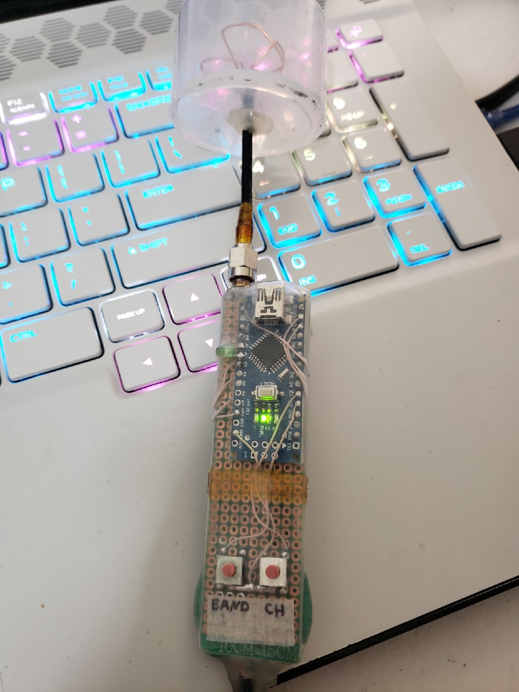
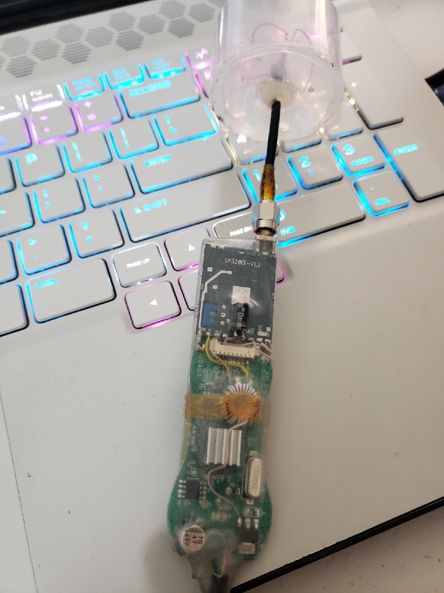
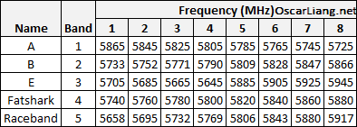

# GPS-to-Serial

    

        
        
    

## What is it for?

This device was designed for adjusting and setting up frequency and band of the video receiver that comes from a FPV camera's transmitter.
It also shows the chosen frequency by flashing the LED numerous times according to the table provided below.

## Set up

In order to establish transmission between a receiver and a camera, you would have to adjust band by pressing the 'band' button and choose the frequency by pressing the 'ch' button exact times according to this table:

    

        
    

E. g. for establishing connection on the 5771 MHz, press 'band' 2 times and and 'ch' 3 times.
